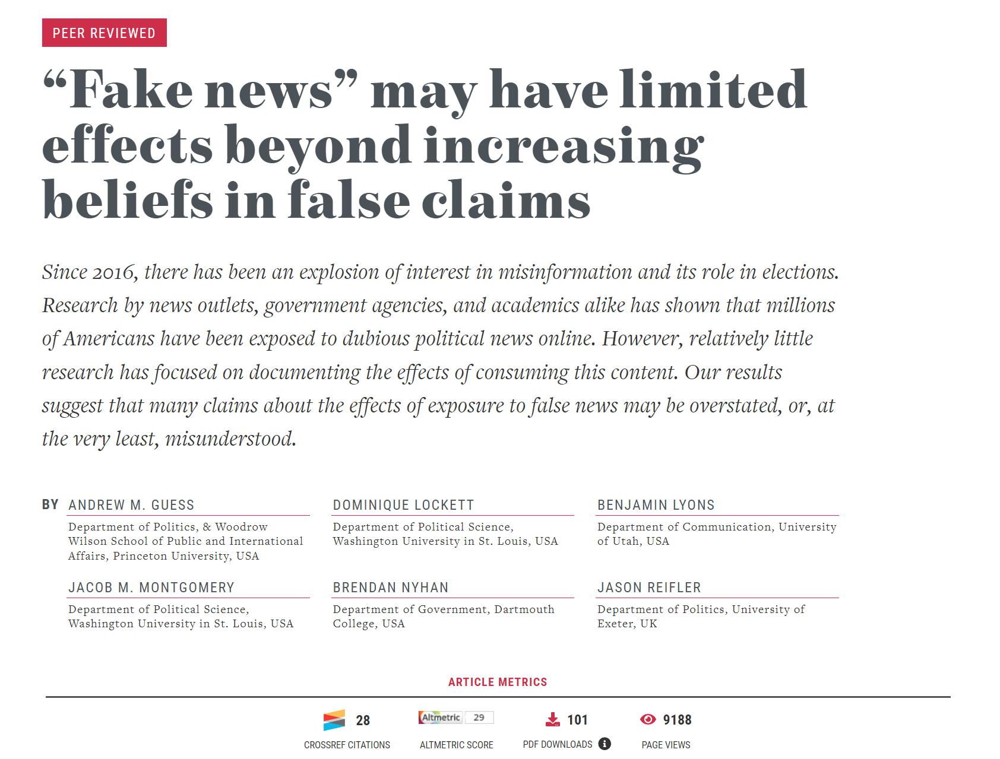

# Fake News Experiment

## Goals
The primary goal of this project was to examine the effects of exposure to "fake news" on political beliefs and participation. Specifically, the research aimed to understand how untrustworthy news websites influence political attitudes, beliefs, and behaviors.

## Data

- **Observational Data:** The study collected web browsing histories from three nationally representative samples, totaling over 7,500 respondents, to track their consumption of untrustworthy websites.
- **Experimental Data:** Participants were randomly exposed to false news articles to measure the immediate effects on their political attitudes and behaviors.

## Design 

- **Data Collection:** Web browsing data were consensually collected using browser extensions, ensuring a representative sample across different demographics.
- **Experiment Design:** Participants were shown fabricated news articles designed to appear similar to real news. Their beliefs and intended political actions were measured before and after exposure.
- **Statistical Analysis:** Advanced statistical techniques, including regression analysis and propensity score matching, were used to isolate the effects of fake news exposure from other variables.

## Key Findings
1. **Belief in False Claims:** Exposure to untrustworthy websites increases belief in politically congenial false claims. This effect is more pronounced among individuals who frequently consume such content.
2. **Political Participation:** The study finds limited evidence that fake news directly affects overall political participation. However, there is a slight increase in the intent to vote among those exposed to fake news.
3. **Trust in Media:** Consumers of untrustworthy websites exhibit decreased trust in mainstream media, contributing to a more polarized media environment.

## Methodological contributions

My role in this project was to handle the data cleaning, transformation and visualization. The large scale experiment had already been designed and conducted, at which point I was hired to ensure that all pre-registered hypotheses were tested and visualized for co-authors. After providing the scientists with their results, we worked together to identify the most relevant information to include in our publication to the Harvard Misinformation Review.

### Comprehensive Analysis of Fake News Effects

**Description:**
The [`FN_Effects/Full_analyses.R`](https://github.com/domlockett/fake_news_experiment/blob/main/FN_Effects/Full_analyses.R) code conducts a comprehensive analysis of fake news exposure and its effects using various statistical models. It uses data from two waves (June and October) and includes numerous hypotheses testing. The analysis is designed to understand the relationship between selective exposure (what websites do participants visit), fake news consumption, political beliefs, and other demographic factors. The code is primarily written in R and makes extensive use of statistical libraries and regression models.

**Key Components:**

1. **Data Loading and Preparation:**
   - Load data from .dta files for the June and October waves.
   - Convert variables to appropriate data types (e.g., factors, numeric).
   - Create new variables to represent:
     - Shares of fake news in the information diet.
     - Total volume of news consumed.
     - Proportion of news from different sources.
     - Average credibility ratings of consumed news.
     - Time spent consuming different types of news.
     - Diversity of news sources.

2. **Hypotheses Testing (H-A1, H-A2, H-A3, H-E1, etc.):**
   - **H-A1:** Analyze whether individuals with a strong tendency toward selective exposure consume more fake news.
     - Model multiple dependent variables (total fake news count, binary exposure, share of information diet) using weighted linear regression.
   - **H-A2:** Test if consumers of fake news are more likely to believe it is accurate.
     - Include interaction terms with political leanings and cognitive reflection test (CRT) scores.
   - **H-A3:** Examine if fake news consumers hold more topical misperceptions.
     - Model the perceived accuracy of true and false statements.
   - **H-E1:** Investigate the impact of fake news on affective polarization, media trust, voting intent, and political action.
     - Use various predictors, including the congeniality of fake news and demographic factors.

3. **Kernel Regression Analysis:**
   - Utilize Kernel Regularized Least Squares (KRLS) to analyze non-linear relationships.
   - Run models for both the June and October waves.

4. **Interaction Effects and Moderation Analysis:**
   - Explore potential moderators like political interest, knowledge, trust in media, and feelings toward Trump.
   - Test heterogeneous effects of pro- and counter-attitudinal fake news exposure.

5. **Output and Visualization:**
   - Display results using screenreg and texreg functions for regression tables.
   - Generate plots to visualize kernel regression results.

6. **Additional Analysis for Exploratory Questions:**
   - Include exploratory analysis on racial animosity and its interaction with fake news exposure.

### [Publication](https://misinforeview.hks.harvard.edu/article/fake-news-limited-effects-on-political-participation/) 
**Description:**
The [`replication_materials/misinfo-review_public.RMD`](https://github.com/domlockett/fake_news_experiment/blob/main/replication_materials/misinfo-review_public.rmd) is a file and directory I produced so that the entire project could be made publically available on the Harvard Dataverse Database for scholarly replication materials. 
It appears that I made a mistake, and section 7 ("Exploratory Analysis") does not exist in the document `misinfo-review_public.RMD`. Here is the corrected description:

### Key Sections:

1. **Data Loading and Preparation:**
   - Loads necessary libraries like `tidyverse`, `survey`, `lmtest`.
   - Imports datasets focusing on misinformation review data.
   - Converts variables to appropriate types (categorical, numerical).
   - Creates variables to quantify misinformation prevalence.

2. **Descriptive Statistics:**
   - Provides summary statistics, tables, and visualizations.
   - Breaks down the sample demographically.

3. **Hypotheses Testing:**
   - **H1:** Tests correlation between exposure to misinformation and belief accuracy.
   - **H2:** Examines if misinformation consumption leads to more misperceptions.
   - **H3:** Analyzes the impact on political behavior and attitudes.

4. **Kernel Regression Analysis:**
   - Uses Kernel Regularized Least Squares (KRLS) for non-linear relationships.
   - Visualizes kernel regression results.

5. **Interaction Effects and Moderation Analysis:**
   - Explores moderation effects of political interest, knowledge, media trust, and sentiments towards political figures.

6. **Output and Visualization:**
   - Uses `screenreg` and `texreg` for regression tables.
   - Generates advanced plots to summarize findings.

Below you will find additional plots I contributed to the project:

### Figure 4A
**Effect of False Article Exposure on Media Trust and Affective Polarization:**
- **Media Thermometer:** Measures respondents' trust in the media.
- **Affective Polarization:** Measures the difference in feelings towards the preferred party vs. the opposition party.
- **Findings:** Exposure to false articles shows varied effects on media trust and affective polarization, with differences observed between fall and summer.

### Figure 4B
**Effect of False Article Exposure on Media Trust and Political Participation:**
- **Media Trust:** Measures trust in the mass media.
- **Vote Plan (Binary):** Likelihood of voting.
- **Vote Plan (Continuous):** Scale of vote intention.
- **Political Action:** Willingness to take political actions.
- **Findings:** Exposure to false articles influences trust in media, vote intention, and political action, with effects varying by season (fall and summer).

You can find the detailed document [here](https://github.com/domlockett/fake_news_experiment/blob/main/replication_materials/misinfo-review_public.rmd).

## Acknowledgement
This project is a collaborative effort involving significant contributions from various scholars. The provided files and scripts reflect the extensive work done to understand and address the impacts of fake news on political behavior. Created for academic purposes, any anonymized data has been removed to ensure privacy and confidentiality. Developed for Washington University in Saint Louis Political Science Department, as well as Exeter and Princeton University. Special thanks to all authors for agreeing to publicize my contributions to the project.
